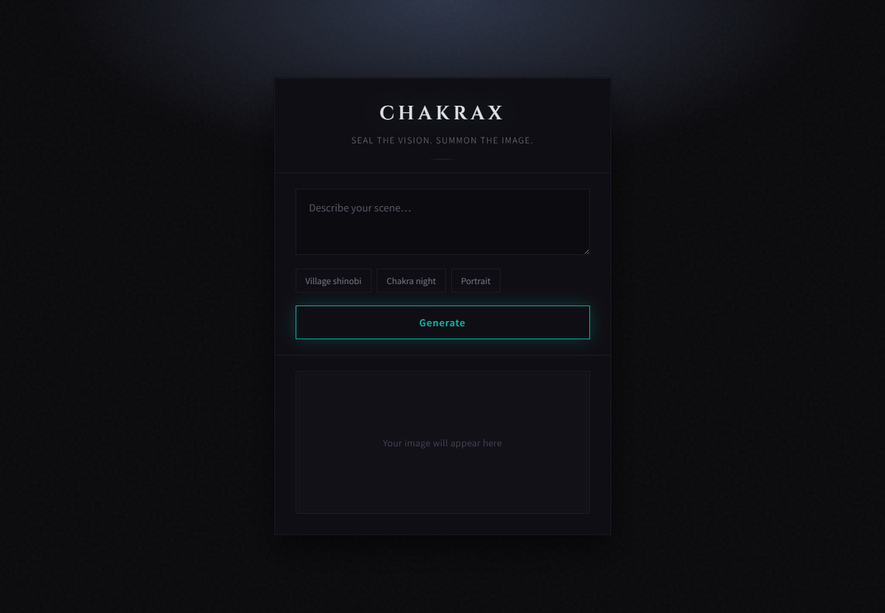
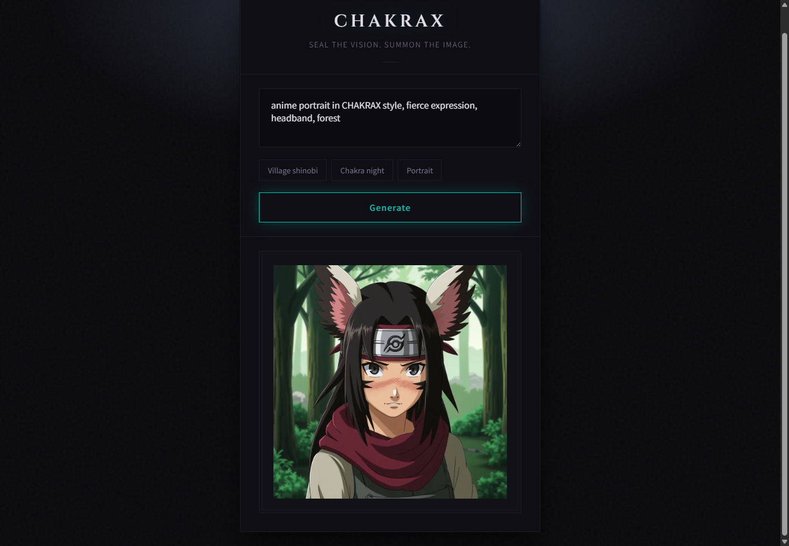

# CHAKRAX | Naruto Style Image Generator

A small web app that generates Naruto-inspired anime ninja images using a fine-tuned model on [Replicate](https://replicate.com). Enter a prompt; the app returns an image via a server-side API route. The UI is dark, cinematic, and ninja-themed.

## Features

- **Prompt-based generation** — Describe a scene; the model returns a single image.
- **Example prompt chips** — One-click prompts to try the style.
- **Server-side API** — The Replicate token lives in environment variables and is never exposed to the client.
- **CLI backup script** — Optional Node script to generate one image and save it as `output.png`.
- **Anime-inspired UI** — Custom kunai cursor, chakra-style cursor spark trail (desktop), and falling cherry blossom petals and whole flowers for a ninja-themed atmosphere.

## Tech stack

- **Frontend:** HTML, CSS, JavaScript (no framework).
- **Backend:** Node.js serverless function (Vercel-style `api/` route).
- **AI model:** Replicate — [naruto-chakrax-style](https://replicate.com/resilientcoders/naruto-chakrax-style) (fine-tuned for Naruto-style art).

## Local setup

1. **Prerequisites:** Node.js 20 or later.
2. **Clone or download** the project and open a terminal in the project root.
3. **Install dependencies:**

   ```bash
   npm install
   ```

4. **Environment variable:** Create a `.env` file in the project root (see below). Do not commit it.

## Required environment variable

Create a `.env` file in the project root:

```env
REPLICATE_API_TOKEN=your_token_here
```

Get a token at [replicate.com/account](https://replicate.com/account).

**Warning:** Never commit `.env` or expose your token in client-side code. The `.env` file is in `.gitignore`; keep it that way.

## Run the CLI backup script

Generate a single image from the command line and save it as `output.png`:

```bash
npm start
```

Uses the hardcoded prompt in `index.js`. Handy for quick tests without the web UI.

## Run the web app locally

1. From the project root:

   ```bash
   npm run local
   ```

2. If prompted, run `vercel login` once.
3. Open the URL shown (e.g. `http://localhost:3000`).
4. Enter a prompt or click an example chip, then click **Generate**. The image appears in the result area below.

## Deployment

This project is set up for deployment on Vercel.

Add this environment variable before deploying:

`REPLICATE_API_TOKEN`

You can deploy either through a GitHub repository connection or with the Vercel CLI. Pushing to `main` triggers a new production build.

## Screenshots

| Homepage | Generated result |
|----------|------------------|
|  |  |

---

*CHAKRAX uses the Replicate API. Keep your token in server-side environment variables only.*
